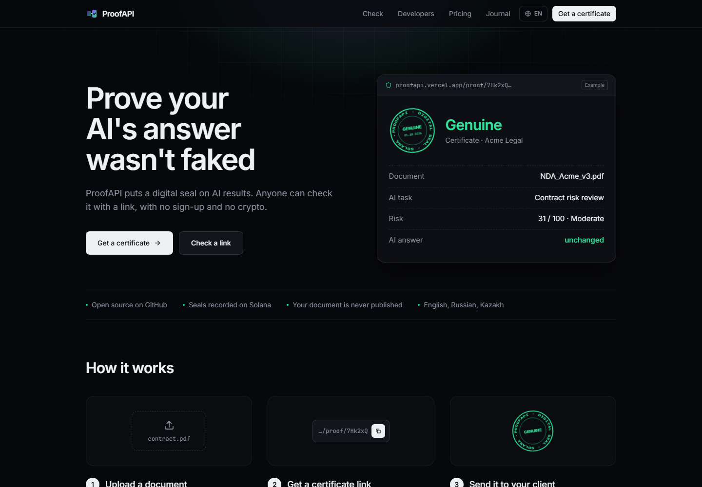
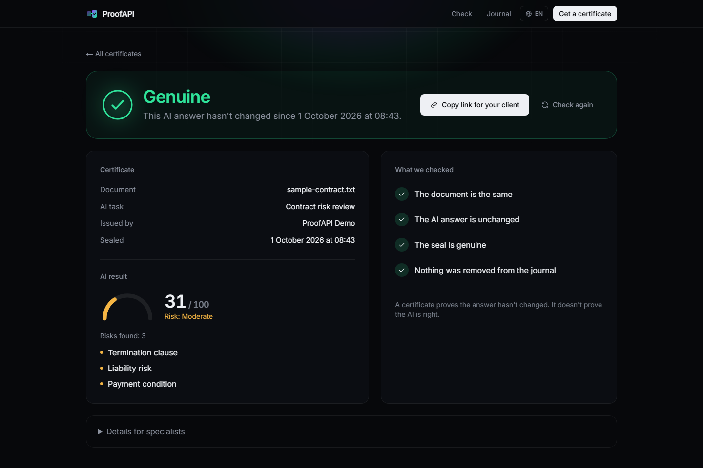
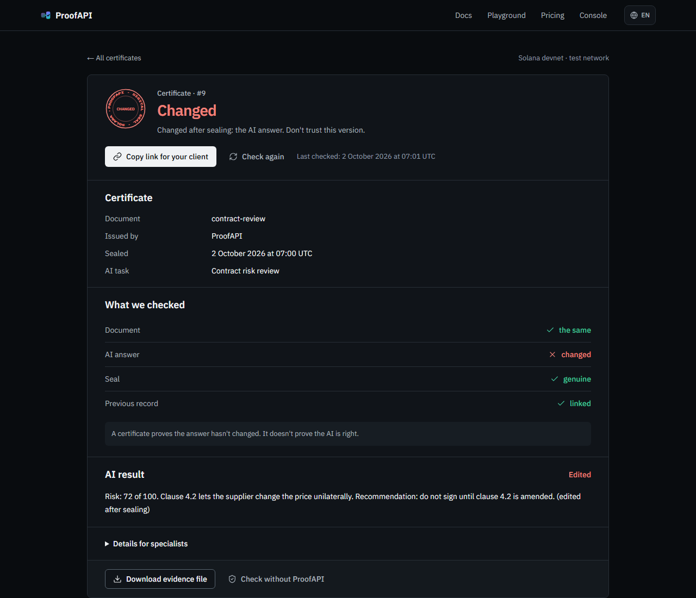
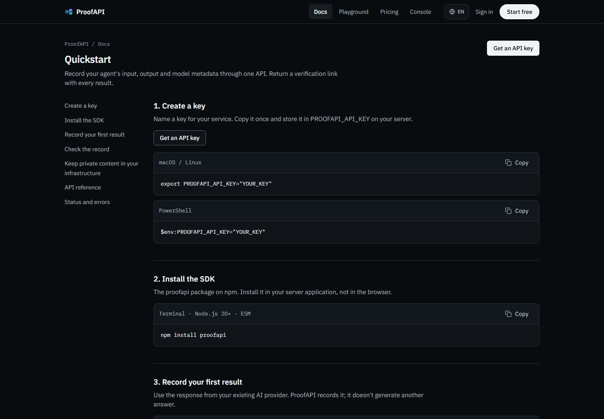

# ProofAPI — Tamper-Evident Receipts for AI Answers

[](https://github.com/Kriazer078/proofapi/actions/workflows/ci.yml)
[](LICENSE)
[](https://explorer.solana.com/address/5ffvduJkfxLgFiJEoZ9Pjq7oPVW1aKCgfqzmEto1FqjU?cluster=devnet)
[](https://www.npmjs.com/package/proofapi)
[](https://colosseum.org)

> ProofAPI puts a digital seal on every AI answer. The input, the answer and the settings are fingerprinted and recorded by our own Solana program. Anyone with the link can check that nothing was changed — no account, no crypto wallet.

[Live Demo](https://proofapi.vercel.app) · [Video Walkthrough](#resources) · [Docs](https://proofapi.vercel.app/developers) · [npm](https://www.npmjs.com/package/proofapi) · [X](https://x.com/ProofAPI) · [Colosseum Submission](#resources)

---



---

## Submission to 2026 Solana National Hackathon

| Name | Role | Contact |
|------|------|---------|
| Bekarys | CEO | [proofapiofficial@gmail.com](mailto:proofapiofficial@gmail.com) · [X](https://x.com/ProofAPI) |
| Nurdaulet | CTO | [GitHub](https://github.com/Kriazer078) |

All code in this repository was written during the hackathon (first commit on 30 September 2026). It uses open-source libraries listed under [Tech Stack](#tech-stack).

---

## Problem and Solution

### 1. AI answers can be edited after the fact
- **Problem:** A team sends a client an AI contract review or an agent makes a refund decision. Later the answer is changed, and nobody can prove what the AI actually said.
- **ProofAPI:** At the moment of the AI call, SHA-256 fingerprints of the input, the answer and the metadata are recorded on Solana. Change one character later and the certificate turns red.

### 2. Logs don't convince outsiders
- **Problem:** Server logs and hash chains kept by the company can be rewritten by the same company.
- **ProofAPI:** The history lives in a public Solana program. Sequence numbers, hash links and the issuer's signing key are enforced on-chain, and the time comes from the Solana clock.

### 3. Inconvenient records can be deleted quietly
- **Problem:** If a record is removed from the operator's database, a normal log simply has a gap nobody notices.
- **ProofAPI:** Every record is numbered and linked to the previous one. The history audit walks the chain on Solana and flags any record that is missing or different.

### 4. Documents are private
- **Problem:** Client contracts and user data can't be published on a blockchain.
- **ProofAPI:** Only salted fingerprints go on-chain. In hash-only mode the data never leaves your servers.

| Genuine | After someone edits the AI answer |
|---|---|
|  |  |

**What a certificate does not prove:** that the AI answer is correct, or which model really ran (the model is declared by the caller). It proves the recorded data hasn't changed since it was sealed.

---

## Why Solana

- **Rules enforced by a program, not by us** — sequence numbers, the hash chain and the writer key are checked on-chain, so the operator can't rewrite its own history.
- **Cheap, fast records** — one record is a 233-byte account (about 0.0025 SOL rent) and confirms in seconds, so every AI answer can be sealed.
- **Trusted time** — timestamps come from the Solana `Clock`, so records can't be back-dated.
- **Anyone can verify** — verification reads public accounts from any RPC endpoint, without our servers.

---

## Summary of Features

- **For developers:** `POST /api/v1/seal` with API keys, TypeScript SDK on npm (`npm install proofapi`), playground, console with keys, usage and records
- **For AI agents:** MCP server (`proofapi-mcp`) with `seal_answer`, `seal_hashes`, `verify_record` and `get_evidence`; machine-readable [`llms.txt`](https://proofapi.vercel.app/llms.txt) and [`openapi.json`](https://proofapi.vercel.app/openapi.json)
- **For recipients:** plain-language certificate page — **Genuine** or **Changed**, with four simple checks
- Hash-only mode: send fingerprints only, keep the data at home
- History audit that finds deleted, edited and unlinked records
- Evidence pack (JSON) and a standalone [`verifier.html`](public/verifier.html) that checks it against Solana directly
- Document review with Google Gemini: upload a PDF or TXT, get an AI risk review and a sealed certificate
- GitHub sign-in, per-account monthly limits, per-address limits for anonymous use
- English, Russian and Kazakh interface



---

## Tech Stack

| Layer | Technology |
|-------|-----------|
| On-chain program | Rust · Anchor (built and deployed with Solana Playground) |
| Chain client | TypeScript · `@solana/web3.js` v1 · hand-written Anchor encoding |
| Web app and API | Next.js 15 (App Router) · React 19 · Tailwind CSS 4 · shadcn/ui (Base UI) |
| Auth | Auth.js (NextAuth) with GitHub · hashed API keys |
| Database | Prisma 6 · SQLite locally · Postgres (Neon) in production |
| SDK and MCP | TypeScript ESM package [`proofapi`](https://www.npmjs.com/package/proofapi) · Model Context Protocol SDK |
| AI | Google Gemini (`gemini-3.5-flash-lite`, structured output); deterministic mock without a key |
| Independent verifier | Single HTML file · WebCrypto · Solana JSON-RPC |
| Testing | Vitest (135 tests) · byte-level fake of the program · devnet end-to-end script · GitHub Actions |
| Hosting | Vercel (fra1) |

---

## Architecture

```
 AI agent (MCP) · SDK · HTTP API · Browser
        │  input + answer (or fingerprints only)
        ▼
 ┌─────────────────────────── Next.js app ───────────────────────────┐
 │ API key / session → limits → canonical JSON → salted SHA-256 x3   │
 │ (input, output, metadata)                                         │
 │                                                                   │
 │ Postgres: users, API keys, records, salt         ProofService     │
 └───────────────────────────────────┬───────────────────────────────┘
                                     │ create_proof(proof_id, 3 hashes)
                                     ▼
 ┌──────────────── Solana program proof_registry ────────────────────┐
 │ Issuer PDA   ["issuer", authority]   writer key, active, count,   │
 │                                      last_record_hash             │
 │ ProofRecord  ["proof", issuer, seq]  hashes, prev_record_hash,    │
 │                                      record_hash, timestamp       │
 │ record_hash = SHA256("proofapi-v1" ‖ fields ‖ prev ‖ timestamp)   │
 └───────────────────────────────────┬───────────────────────────────┘
                                     │ getAccountInfo (any RPC)
                                     ▼
       Certificate page  ·  History audit  ·  verifier.html (offline)
```

**Program:** [`programs/proof_registry/src/lib.rs`](programs/proof_registry/src/lib.rs) — instructions `register_issuer`, `set_writer`, `set_active`, `create_proof`. There is no instruction to edit or delete a record.

**Devnet deployment:** program [`5ffvduJkfxLgFiJEoZ9Pjq7oPVW1aKCgfqzmEto1FqjU`](https://explorer.solana.com/address/5ffvduJkfxLgFiJEoZ9Pjq7oPVW1aKCgfqzmEto1FqjU?cluster=devnet). Details in [`programs/proof_registry/README.md`](programs/proof_registry/README.md).

---

## Quick Start

### Use the hosted API

```bash
npm install proofapi
```

```ts
import { ProofAPI } from 'proofapi';

const proofapi = new ProofAPI({ apiKey: process.env.PROOFAPI_API_KEY }); // key from /console/keys
const record = await proofapi.seal({ input: prompt, output: answer, model: 'your-model' });
console.log(record.certificateUrl); // share this link
```

Connect an AI agent through MCP (Claude, Cursor and other clients):

```json
{
  "mcpServers": {
    "proofapi": {
      "command": "npx",
      "args": ["-y", "-p", "proofapi", "proofapi-mcp"],
      "env": { "PROOFAPI_API_KEY": "pk_live_..." }
    }
  }
}
```

### Run it locally

**Prerequisites:** Node.js 20+. No Rust toolchain is needed: the program is built in [Solana Playground](https://beta.solpg.io).

```bash
git clone https://github.com/Kriazer078/proofapi
cd proofapi
npm install
cp .env.example .env
npm run db:push
npm test
npm run dev
```

Open http://localhost:3000. By default `CHAIN_MODE=memory` runs a local simulation of the program. Set `AUTH_DEV_LOGIN=1` to try the console without a GitHub app (ignored in production).

**On Solana devnet:**

```bash
npm run setup            # creates server keys in .keys/ (git-ignored)
# fund the printed writer address at https://faucet.solana.com
# set PROGRAM_ID and CHAIN_MODE=anchor in .env (or deploy your own copy, see programs/proof_registry/README.md)
npm run register-issuer
npm run chain:status
npm run e2e:devnet       # create, verify, tamper, audit, and write an evidence pack
```

**Production settings:** `GEMINI_API_KEY` for AI review, `AUTH_GITHUB_ID` and `AUTH_GITHUB_SECRET` for GitHub sign-in (callback `/api/auth/callback/github`). The sign-in secret is derived from `IP_HASH_SALT` unless `AUTH_SECRET` is set.

---

## Roadmap

- [x] Own Solana program with numbered, hash-linked records
- [x] Certificates, history audit and independent offline verifier
- [x] Hash-only mode for private data
- [x] API keys, developer console and GitHub sign-in
- [x] TypeScript SDK on npm and MCP server for AI agents
- [x] AI document review with Google Gemini
- [ ] Python SDK and more AI providers (OpenAI, Anthropic) behind the same interface
- [ ] Batching many records into one account (Merkle root) to cut cost
- [ ] zkTLS proof that an answer came from the AI provider's API
- [ ] Qualified eIDAS timestamps on top of the record hash
- [ ] Mainnet deployment after a security review

---

## Resources

- [Live Application](https://proofapi.vercel.app)
- [Developer Docs](https://proofapi.vercel.app/developers)
- [npm package](https://www.npmjs.com/package/proofapi)
- [X / Twitter](https://x.com/ProofAPI)
- Contact: [proofapiofficial@gmail.com](mailto:proofapiofficial@gmail.com)
- [Program on Solana Explorer (devnet)](https://explorer.solana.com/address/5ffvduJkfxLgFiJEoZ9Pjq7oPVW1aKCgfqzmEto1FqjU?cluster=devnet)
- Project Presentation — _coming soon_
- Video Demo — _coming soon_

---

## License

MIT — see [LICENSE](LICENSE)
